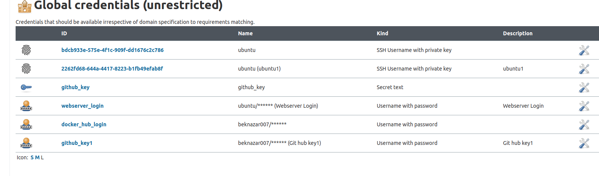
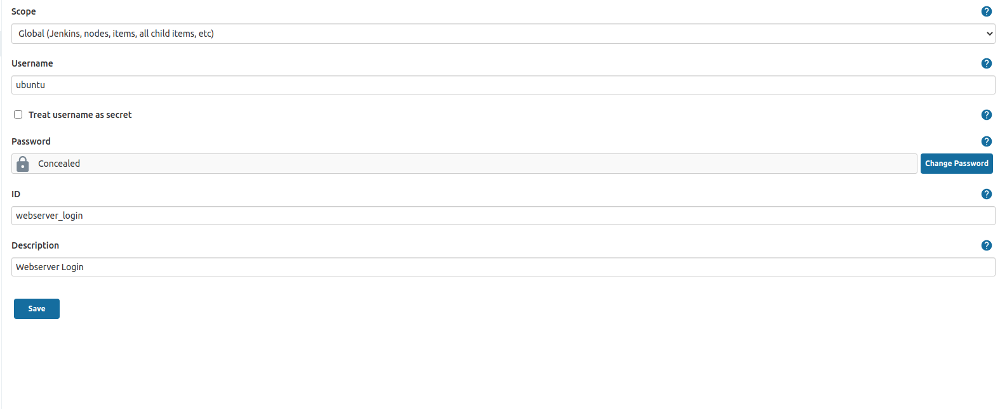
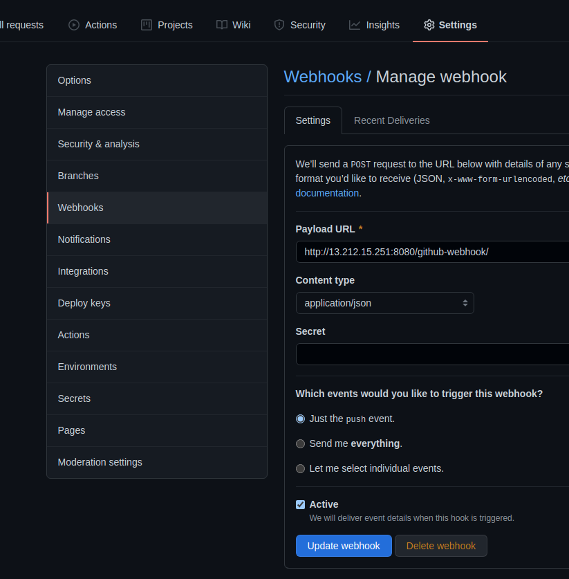
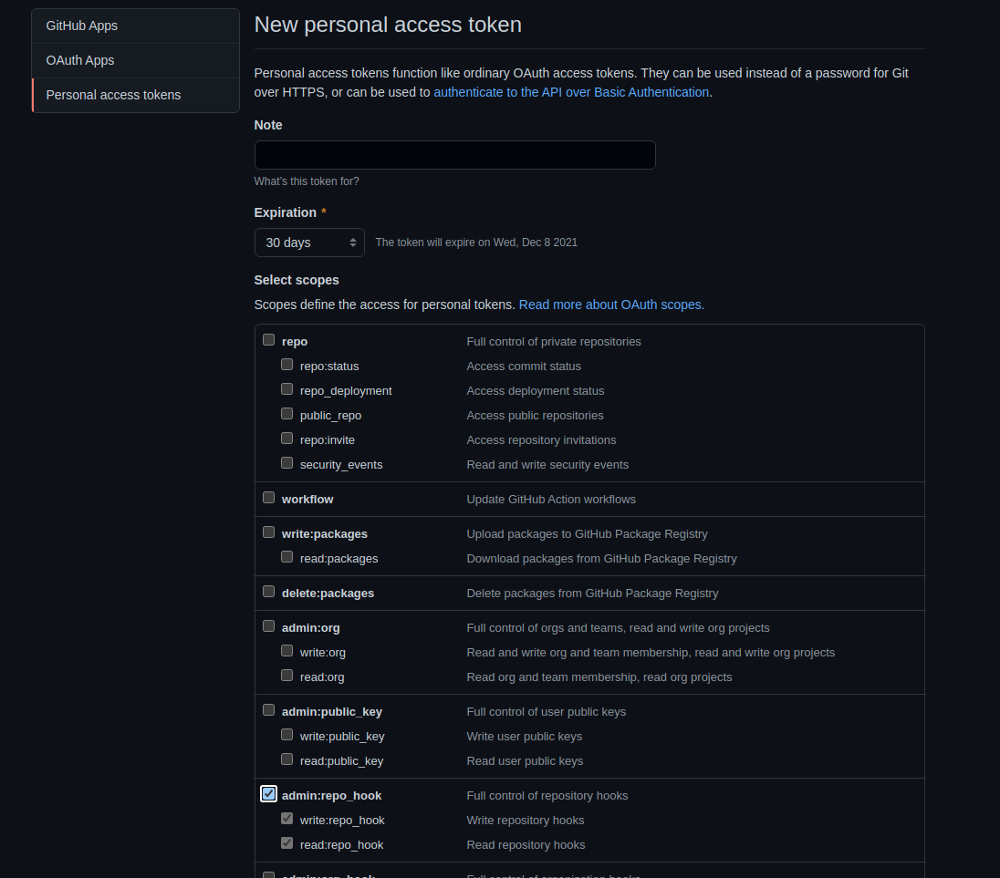

# What we need to have 
1. Dockerfile

        FROM httpd:2.4
        WORKDIR /usr/local/apache2/htdocs
        COPY index.html .
        COPY number.png .
        COPY i.jpeg .
        EXPOSE 8080

2. Jenkinsfile
        
        pipeline{

            agent any

            environment {
                    DOCKERHUB_CREDENTIALS=credentials('docker_hub_login')
            }

            stages {

                    stage('Build') {

                            steps {
                                    sh 'docker build -t beknazar007/jenkins .'
                            }
                    }

                    stage('Login') {

                            steps {
                                sh 'docker login -p $DOCKERHUB_CREDENTIALS_PSW -u $DOCKERHUB_CREDENTIALS_USR'
                            }
                    }

                    stage('Push') {

                            steps {
                                    sh 'docker push beknazar007/jenkins'
                            }
                    }

                     stage('TestingOnDev') {
                         steps {                       
                            withCredentials([usernamePassword(credentialsId: 'webserver_login', usernameVariable: 'USERNAME', passwordVariable: 'USERPASS')]) {
                                script {
                                    sh "sshpass -p '$USERPASS' -v ssh -o StrictHostKeyChecking=no $USERNAME@$prod_ip \"docker pull beknazar007/jenkins\""
                                    try {
                                        sh "sshpass -p '$USERPASS' -v ssh -o StrictHostKeyChecking=no $USERNAME@$prod_ip \"docker stop final1\""
                                        sh "sshpass -p '$USERPASS' -v ssh -o StrictHostKeyChecking=no $USERNAME@$prod_ip \"docker rm final1\""
                                    } catch (err) {
                                         echo: 'caught error: $err'
                                    }
                                    sh "sshpass -p '$USERPASS' -v ssh -o StrictHostKeyChecking=no $USERNAME@$prod_ip \"docker run --restart always --name final1 -p 8088:80 -d beknazar007/jenkins\""
                                }
                            }
                         }
                     }

                    stage('DeployToProduction') {
                         steps {
                            input 'Deploy to Production?'
                            milestone(1)
                            withCredentials([usernamePassword(credentialsId: 'webserver_login', usernameVariable: 'USERNAME', passwordVariable: 'USERPASS')]) {
                                script {
                                    sh "sshpass -p '$USERPASS' -v ssh -o StrictHostKeyChecking=no $USERNAME@$dev_ip \"docker pull beknazar007/jenkins\""
                                    try {
                                        sh "sshpass -p '$USERPASS' -v ssh -o StrictHostKeyChecking=no $USERNAME@$dev_ip \"docker stop final22\""
                                        sh "sshpass -p '$USERPASS' -v ssh -o StrictHostKeyChecking=no $USERNAME@$dev_ip \"docker rm final22\""
                                    } catch (err) {
                                         echo: 'caught error: $err'
                                    }
                                    sh "sshpass -p '$USERPASS' -v ssh -o StrictHostKeyChecking=no $USERNAME@$dev_ip \"docker run --restart always --name final22 -p 8088:80 -d beknazar007/jenkins\""
                        }
                    }
                }
            }
          }
          } 
3.   Index file of site

# Steps 
>
1. Dockerhub get login/password  
2. Instance credentials install pem file
3. Configure AWS 
    1. Log in to instace
        1. Change passwd in both of them
              
                sudo passwd ubuntu
        2. Install docker
                
              <a href="https://docs.docker.com/engine/install/ubuntu/" target="_blank">sudo apt install docker </a>

        3. Give access to user 
                
                sudo apt update
                sudo apt install sshpass
                sudo usermod -aG docker ubuntu
                cd /var/run
                sudo chmod 777 docker.sock
                sudo service docker restart
                nano /ets/ssh/sshd_config
                      # change no > yes to allow other
                      PasswordAuthentication yes
                sudo service network restart

    
    
4. Configure Jenkins  
    
    >1. Add to there docker credentials and pem file and password which we paste for both of them when we configure servers of Instances  **Manage Jenkins>Manage Credentials>(gobal)>Add credentials
    

    
    
    >Add credential

    
1. Webhook

>Click Webhook and add new hook . Put IP address of jenkins server
1. Token file
>Click **Settings>Developer settings**  
